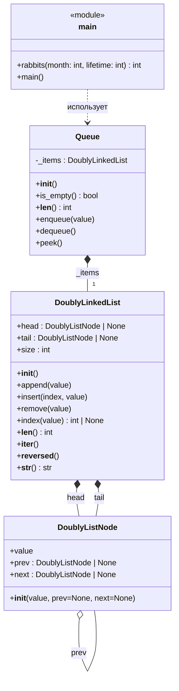

# Диаграмма классов

```mermaid
classDiagram
    class DoublyListNode {
        +value
        +prev : DoublyListNode | None
        +next : DoublyListNode | None
        +__init__(value, prev=None, next=None)
    }

    class DoublyLinkedList {
        +head : DoublyListNode | None
        +tail : DoublyListNode | None
        +size : int
        +__init__()
        +append(value)
        +insert(index, value)
        +remove(value)
        +index(value) int | None
        +__len__() int
        +__iter__()
        +__reversed__()
        +__str__() str
    }

    class Queue {
        -_items : DoublyLinkedList
        +__init__()
        +is_empty() bool
        +__len__() int
        +enqueue(value)
        +dequeue()
        +peek()
    }

    class main {
        <<module>>
        +rabbits(month: int, lifetime: int) int
        +main()
    }

    DoublyLinkedList *-- DoublyListNode : head
    DoublyLinkedList *-- DoublyListNode : tail
    DoublyListNode o-- DoublyListNode : next
    DoublyListNode o-- DoublyListNode : prev
    Queue *-- "1" DoublyLinkedList : _items
    main ..> Queue : использует
```
