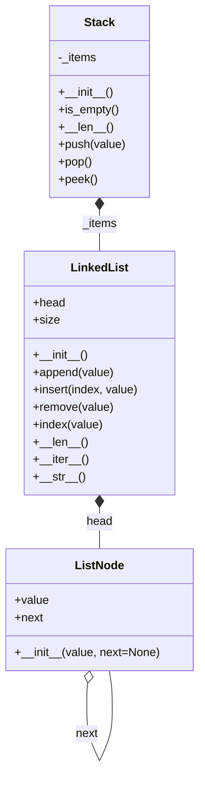

# Диаграмма классов

```mermaid
classDiagram
    class Stack {
        -_items
        +\_\_init\_\_()
        +is_empty()
        +\_\_len\_\_()
        +push(value)
        +pop()
        +peek()
    }

    class LinkedList {
        +head
        +size
        +\_\_init\_\_()
        +append(value)
        +insert(index, value)
        +remove(value)
        +index(value)
        +\_\_len\_\_()
        +\_\_iter\_\_()
        +\_\_str\_\_()
    }

    class ListNode {
        +value
        +next
        +\_\_init\_\_(value, next=None)
    }

    Stack *-- LinkedList : _items
    LinkedList *-- ListNode : head
    ListNode o-- ListNode: next
```
